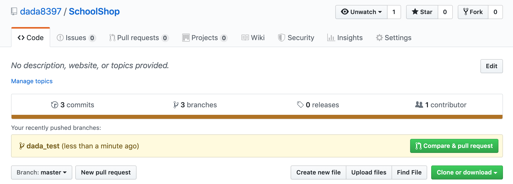
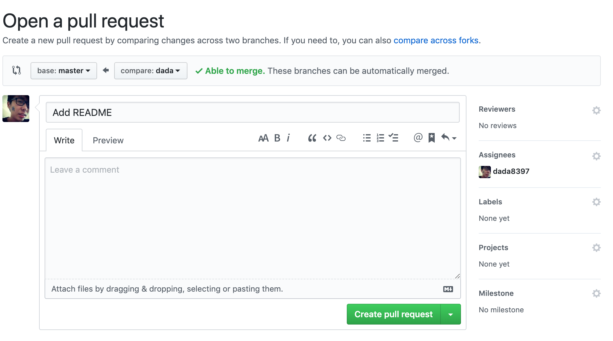

# SchoolShop

A final project for AAD course...

## Git Flow

[Git Flow 教學](https://ihower.tw/blog/archives/5140)

### New branch

```
git pull origin master
git branch {your_name}
git checkout {your_name}
```

### Merge and push project

```
# After commit
git fetch --all
git merge origin/master
# Fix conflict (if have any), if you don't know how to fix it, contact dada
git push origin {your_name}
```
1. Go to [github page](https://github.com/dada8397/SchoolShop).

2. Select "Compare & pull request".

3. Select Assignee to dada8397.
4. Press "Create pull request".
5. Contact dada and wait for merge.
